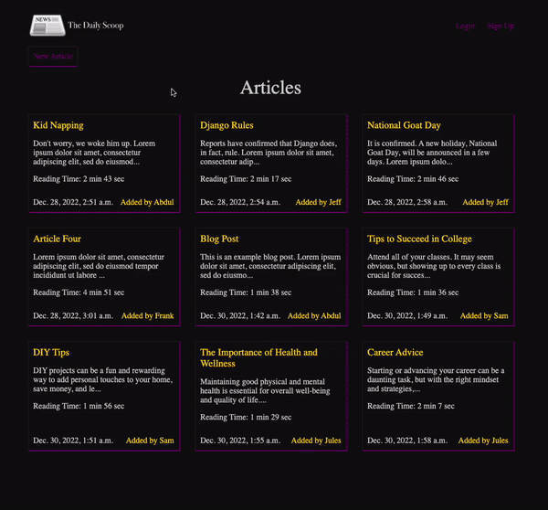

## The Daily Scoop Blog App

### App Description

The Daily Scoop is built using Django. Users are able to sign up, login, and add their own blogs to the site. They can also view and read others' blogs on the site.
### App Demo

 

### Features

- Article list page
- Specific article page
- User Authentication
- Dark theme
